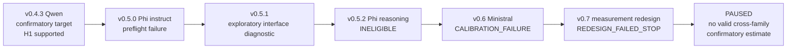

# Before Calling It a Non-Replication: Instrument Qualification Across LLM Families

**Preprint-ready manuscript v0.3**  
**Article type:** methodological note / negative-results case study  
**Behavioral data:** no new data beyond the archived IAER v0.4.3–v0.7 program

## Abstract

When a behavioral effect observed in one large language model is absent on another model family, the result is often described as weak generalization or non-replication. That interpretation assumes that the task remains an interpretable measurement instrument for the new model. We examine this assumption through a preserved sequence of cross-family qualification attempts following a completed confirmatory evidence-weighting study. The original Qwen study found that five explicitly derivative reviews of one source increased retention of an initial claim relative to an equal-sized unrelated-memory control (22/32 versus 0/32; paired risk difference 0.6875; Holm-adjusted exact McNemar p = 9.5367e-7). Subsequent Phi and Ministral programs introduced frozen preflight, eligibility, calibration, and redesign gates before permitting confirmatory collection. None reached a valid cross-family confirmatory estimate: Phi-4-mini-instruct failed mandatory preflight; Phi-4-mini-reasoning completed a technically valid eligibility pilot but failed the frozen behavioral gates; Ministral passed simple evidence controls but failed a multiple-independent-evidence control under two prespecified response interfaces; and a preregistered redesign that removed probabilistic aggregation still failed its accuracy and symmetry gates. These outcomes are not valid negative replications of the original effect because the target contrast was never collected after the candidate configurations had demonstrated the prerequisites required to interpret it. We present this history as a case study in **instrument qualification and measurement transport** across LLM families. We propose a practical reporting distinction among valid replication/non-replication, configuration ineligibility under the instrument, and invalid/inconclusive execution. The broader lesson is that reusing task text across model families does not by itself establish that the same scientific quantity is being measured.

## 1. Introduction

If a behavioral effect disappears on another LLM, when is that evidence of non-replication—and when has the new model simply failed the prerequisites of the instrument?

Cross-model evaluation often treats a prompt or benchmark as if it were a transparent measurement device. An effect is observed in one model, the task is transferred to another model family, and the new score is compared with the old one. But an LLM task can impose several demands at once: instruction following, response-format compliance, resistance to label and order artifacts, belief revision, quantitative evidence integration, and the target behavior of scientific interest. A candidate model may fail an auxiliary demand even when the target construct remains unresolved.

This is a construct-validity problem, not a new observation about LLM evaluation. Recent work has explicitly argued that benchmark scores require evidence that they support the intended construct interpretation [1,2], and large-scale evaluation research increasingly decomposes task demands from model abilities rather than treating benchmark scores as model-invariant properties [3]. Our contribution is narrower: an auditable, longitudinal case study showing how a cross-family replication program can repeatedly stop **before** a valid target comparison is reached.

The case comes from the Intra-Agent Evidence Recycling (IAER) project. IAER studies whether several memory records derived from one epistemic source can acquire excess behavioral weight even though no new independent evidence has been added. A completed confirmatory study on a Qwen configuration produced a strong preregistered effect. We then attempted to transport that behavioral paradigm to Phi and Ministral configurations.

The later program did not produce a clean null effect. Instead, it encountered a sequence of qualification failures: mandatory preflight failure, response-interface sensitivity, preregistered ineligibility, calibration failure, and finally a failed measurement redesign. At each stage, a frozen STOP rule prevented the target confirmatory comparison from being interpreted when the measurement prerequisites had not been demonstrated.

The central methodological claim is therefore:

> **An absent cross-family effect should not be called a non-replication unless the candidate configuration first demonstrates the prerequisites required to interpret the target comparison.**

We do **not** claim conceptual priority for repetition, redundancy, or dependent-evidence effects. By 2026, peer-reviewed work already shows that paraphrased repetition can outweigh distinct support and that presentation order affects LLM evidence aggregation [4]; redundancy-aware retrieval evaluation is also an established research direction [5]. Current preprints further study duplicate, paraphrased, and diverse retrieved evidence [6] and explicitly frame copied documents as dependent rather than independent corroboration [7]. The contribution here is the preserved empirical structure of a replication program that refused to turn qualification failure into a scientific null result.

## 2. Related work

### 2.1 Repetition, redundancy, and dependent evidence

Naphade [4] introduces GroupQA and studies how LLMs aggregate groups of conflicting RAG evidence. The paper reports that paraphrasing an argument can be more persuasive than providing distinct independent support and also documents presentation-order effects. This is close prior art to the broad IAER phenomenon and rules out any defensible priority claim that IAER first identified a repetition-versus-independence problem.

Cho and Lee [5] develop RARE, a redundancy-aware retrieval evaluation framework for highly similar corpora, showing that standard retrieval assumptions can be misleading in settings with extensive overlap. Ross et al. [6], in a 2026 preprint, directly compare duplicate, paraphrased, and diverse retrieval sets under controlled fictional QA. Rahadi [7], in a position paper/preprint, explicitly argues that copied or derived documents should not be treated as independent corroboration and proposes dependence-aware diagnostics.

The present note therefore does not ask whether repetition or dependence can matter. It asks what should count as evidence of **cross-family non-replication** when the transferred instrument itself fails prerequisite controls.

### 2.2 Belief revision and evidence integration as auxiliary demands

Belief revision is itself nontrivial for LLMs. Wilie et al. [8] evaluate approximately 30 language models on Belief-R and report broad difficulty revising conclusions appropriately when new information changes the warranted inference. Kim, Kim, and Thorne [9] examine evidence with different reliability and informativeness and find that LMs do not consistently follow Bayesian epistemic assumptions.

These findings matter for transportability. A task designed to measure memory-source multiplication may also require the model to integrate probabilistic evidence or revise a prior conclusion. If the candidate model fails that auxiliary operation, a later target score can become ambiguous: is the target effect absent, or did the task cease to function as the intended measurement?

### 2.3 Construct validity and evaluation transport

Alaa et al. [1] explicitly argue that LLM benchmarks should be evaluated for construct validity rather than assumed to measure the capability named by the benchmark. Bean et al. [2] systematically review 445 LLM benchmarks with 29 expert reviewers and identify recurring threats to construct validity. Zhou et al. [3] model both task demand profiles and system ability profiles, emphasizing that aggregate benchmark scores reflect interactions between task demands and model characteristics.

We use **instrument qualification** as a pragmatic operational term. We do not claim formal psychometric measurement invariance. In this paper, a candidate configuration is qualified only if it passes frozen controls that are necessary to interpret the later target comparison.

## 3. Confirmatory target and replication logic

### 3.1 The prior confirmatory target

IAER v0.4.3 was a fixed-N behavioral-confirmatory study on a `qwen3.5-4b` configuration. The principal cross-family target was the preregistered contrast:

`passive_repeat > neutral_filler`

Both conditions began with one external source supporting an INITIAL claim. `neutral_filler` added five unrelated memory records. `passive_repeat` added five target-consistent review records explicitly derived from the same initial source. A later independent counter-source supported the opposing claim.

The v0.4.3 dataset contained 168/168 valid planned trajectories and passed all preregistered validity gates. For the target contrast:

- `passive_repeat`: 22/32 retained INITIAL;
- `neutral_filler`: 0/32 retained INITIAL;
- paired risk difference = 0.6875;
- Holm-adjusted exact paired McNemar p = 9.5367432e-7.

A second hypothesis, that explicit lineage metadata would reduce retention in an active-use manipulation, was not supported.

The original result therefore provided a legitimate but narrow replication target: could the `passive_repeat > neutral_filler` contrast be validly estimated in another model family?

### 3.2 Why qualification preceded target collection

The later program adopted a fail-closed principle: a candidate should not proceed to confirmatory IAER collection if prerequisite controls showed that the candidate could not reliably perform the auxiliary operations required by the instrument.

This created three possible classes of outcome:

1. **qualified target collection** — the candidate passes prerequisites and the confirmatory contrast is collected;
2. **configuration ineligibility under the instrument** — technical collection succeeds, but frozen behavioral prerequisites fail before target collection;
3. **invalid/inconclusive execution** — manipulation, schema, completeness, or another mandatory integrity requirement fails.

Only the first class can yield a valid cross-family replication or non-replication.

## 4. Where the cross-family program stopped

| Version | Candidate / role | Gate reached | Key result | Confirmatory IAER estimate? |
| --- | --- | --- | --- | --- |
| v0.5.0 | Phi-4-mini-instruct | mandatory behavioral preflight | 3/4 required cases passed; mirrored independent-evidence case failed | No |
| v0.5.1 | Phi exploratory diagnostic | response/interface diagnosis | 48/48 valid; 29/48 normative accuracy; strong representation sensitivity | No |
| v0.5.2 | Phi-4-mini-reasoning | preregistered eligibility | 4/12 baseline; 12/12 strong counter; 2/12 independent-five | No |
| v0.6 A | Ministral calibration | Interface A | 8/8 baseline; 8/8 strong counter; 0/8 independent-five | No |
| v0.6 B | Ministral calibration | Interface B | same 8/8, 8/8, 0/8 pattern | No |
| v0.7 | Ministral instrument redesign | explicit root-counting pilot | 35/36 across independent-root-only controls; 7/12 derived lure; symmetry gates failed | No |

### 4.1 Phi: from preflight failure to preregistered ineligibility

The v0.5.0 Phi-4-mini-instruct package required four behavioral preflight cases before confirmatory collection. Three passed. The mirrored `independent_evidence` case with INITIAL=`CLAIM_B` failed, so the fail-closed rule stopped the program before target outcomes were collected.

Because a single preflight failure could reflect response representation rather than the underlying evidence task, v0.5.1 was explicitly exploratory. It completed 48/48 valid diagnostic calls with overall normative accuracy 29/48. Performance varied across `claim_label`, `value_token`, and `explicit_odds` representations. The multiple-independent-evidence condition was weaker than the source-only condition in all three modes.

v0.5.2 then replaced ad hoc diagnosis with a preregistered fixed-N eligibility pilot on Phi-4-mini-reasoning. All 36 planned trajectories were technically valid, but the frozen behavioral gates failed:

- `baseline_initial`: 4/12;
- `counter_single_strong`: 12/12;
- `independent_five_initial`: 2/12.

The final decision was `INELIGIBLE`. No Phi configuration produced a confirmatory IAER estimate.

### 4.2 Ministral: calibration identifies an auxiliary-demand failure

v0.6 formalized the sequence:

**Calibration → Eligibility → Confirmatory IAER**

Calibration deliberately excluded IAER treatment conditions. It tested whether the candidate could perform the normative evidence operations on which the later instrument depended.

Under Interface A, Ministral scored 8/8 on a one-source INITIAL baseline and 8/8 when a stronger single counter-source should overturn INITIAL, but 0/8 when five independent moderate INITIAL sources should collectively defeat one stronger counter-source.

The frozen rule permitted a simplified Interface B only after integrity-valid behavioral failure. Removing the confidence field did not change the pattern: 8/8, 8/8, 0/8. The final decision was `CALIBRATION_FAILURE — STOP BEFORE ELIGIBILITY`.

This is not evidence that IAER was absent in Ministral. The candidate never reached Eligibility or the confirmatory `passive_repeat > neutral_filler` comparison.

### 4.3 v0.7: decoupling probability from source lineage

The repeated `independent_five_initial` failures raised a measurement concern: the control simultaneously tested source independence and probabilistic evidence aggregation. v0.7 therefore removed reliability scores and Bayesian-style aggregation entirely.

The frozen rule became explicit:

1. each independent ROOT SOURCE contributes one epistemic vote;
2. a DERIVED RECORD contributes zero new votes;
3. multiple records derived from one root do not add votes;
4. choose the claim with more independent-root votes.

Across three conditions containing only independent roots, Ministral was correct on 35/36 calls. In the critical derived-record lure, one INITIAL root was accompanied by five records explicitly marked as derived from that root and as adding zero new epistemic votes, while two independent COUNTER roots were present. Accuracy was 7/12.

The critical condition also showed substantial label/order asymmetry: 5/6 correct for INITIAL=`CLAIM_A` versus 2/6 for INITIAL=`CLAIM_B`, and 5/6 for A_FIRST versus 2/6 for B_FIRST. Each cross-cell contained only three items. The preregistered accuracy and symmetry gates therefore failed, producing `REDESIGN_FAILED_STOP`.

The descriptive 35/36-versus-7/12 pattern is scientifically suggestive, but it does not validate an IAER mechanism. v0.7 was preregistered as an instrument-usability redesign and explicitly cannot confirm, refute, or estimate IAER.

## 5. The replication path as a measurement problem

**Figure 1.** The post-v0.4.3 program repeatedly stopped at qualification or redesign gates before a valid cross-family confirmatory IAER contrast was collected. The arrows indicate methodological progression, not evidence that the same failure mechanism operated at every stage.

The key distinction is between **failure to observe an effect under an interpretable target test** and **failure to establish that the target test is interpretable for the candidate configuration**.

The IAER post-Qwen program contains only the second class. Calling the Phi or Ministral histories “negative replications” would imply that the target contrast was validly measured and found absent. It was not.

This distinction is especially important in LLM research because task demands are not model-invariant. A prompt that is trivial for one model may invoke unstable label mappings, evidence aggregation, or response-format behavior in another. Reusing the text therefore preserves surface form, not necessarily measurement interpretation.

## 6. A practical reporting taxonomy

We propose the following **operational reporting distinction**, derived from this case study rather than claimed as a universally validated framework.

### 6.1 Valid replication / valid non-replication

Requirements:

- technical and dataset integrity pass;
- prespecified qualification controls pass;
- the frozen target comparison is collected;
- no post-outcome rescue changes are used to define the test.

Only this category supports inference about whether the target effect generalizes to the candidate configuration.

### 6.2 Configuration ineligibility under the instrument

Requirements:

- technical collection is valid;
- one or more frozen prerequisite behavioral gates fail before target collection.

Interpretation:

> The exact model/interface/configuration did not demonstrate the prerequisites required to interpret the target comparison under this instrument.

This classification is neither evidence for nor evidence against the target effect.

### 6.3 Invalid/inconclusive execution

Examples include:

- manipulation validity failure;
- schema or parse failure under a mandatory gate;
- missing, duplicate, or unplanned keys;
- failure of a frozen integrity condition.

No target inference is permitted.

## 7. Methodological implications

### 7.1 Same task text does not guarantee same measurement

Cross-family replication should preserve the scientific quantity, not merely the prompt. If the new model does not satisfy the auxiliary demands of the instrument, identical wording can yield a non-equivalent measurement situation.

### 7.2 Qualification controls should isolate prerequisite demands

If a target manipulation assumes reliable belief revision, source differentiation, quantitative aggregation, or label/order robustness, those operations should be tested before the target contrast is interpreted. Qualification should be designed to avoid containing the target treatment itself, otherwise the gate risks becoming an unacknowledged pilot of the hypothesis.

### 7.3 Qualification gates should be frozen before candidate outcomes

A gate that is adjusted after failure until the candidate passes cannot protect interpretation. Thresholds, interfaces, retry rules, and STOP logic should be fixed before behavioral outcomes whenever the gate is meant to license later confirmatory inference.

### 7.4 Failed qualification should remain visible

Publishing only the final working prompt hides the extent of measurement transport difficulty and encourages model-shopping. Retaining failed preflights, eligibility decisions, and aborted stages clarifies why a target effect was or was not tested.

### 7.5 Redesign is not retroactive validation

A later redesign can identify or remove a plausible confound, but it does not retroactively make an earlier failed instrument valid. v0.7, for example, showed that removing probabilistic aggregation yielded near-perfect performance on independent-root-only controls, yet the redesigned instrument still failed its own frozen gates.

### 7.6 STOP rules are part of inference discipline

The strongest methodological feature of the post-v0.4.3 program is not that it eventually found another positive result—it did not. It is that the program stopped rather than tuning within the same version until a candidate passed.

## 8. What the program demonstrates, suggests, and leaves unknown

### Demonstrates

- v0.4.3 produced one completed confirmatory Qwen effect under its frozen task/configuration;
- later Phi and Ministral programs did not produce valid cross-family confirmatory IAER estimates;
- technically valid data can still be behaviorally ineligible for a target instrument;
- explicit qualification and STOP rules can prevent instrument failure from being mislabeled as target-effect absence.

### Suggests, but does not establish

- evidence aggregation was an important auxiliary demand in v0.5/v0.6;
- after probabilistic aggregation was removed, derivative-record multiplicity remained associated with degraded performance in the v0.7 lure condition;
- label/order sensitivity may interact with that degradation.

### Remains unknown

- whether the v0.4.3 H1 effect generalizes to Phi, Ministral, or other model families;
- whether derivative records are internally treated as independent evidence;
- whether a lineage-aware mechanism explains the Qwen result;
- whether a different measurement paradigm could produce a stable cross-family target test.

## 9. Limitations

This is a single-program case study, not a systematic experiment on measurement transport across many benchmarks or model families. The proposed reporting taxonomy therefore remains operational rather than validated.

Only the Qwen v0.4.3 configuration produced a completed confirmatory IAER estimate. The post-Qwen stages constrain interpretation but cannot independently establish or falsify cross-family generalization.

The v0.7 redesign used 12 items. Its critical R3 condition showed label/order asymmetry and only three items per crossed cell, so mechanism-level interpretation would be unwarranted.

v0.6 also contained a documented publication-process deviation: several calibration-specific implementation files intended by the Freeze-A publication checklist were absent from the original preregistration tag. The omission was documented without rewriting the historical tag. v0.7 subsequently strengthened the procedure by requiring a complete frozen ZIP release asset and digest verification before behavioral authorization.

The v0.4.3 archive, although independently audited, did not pin every external runtime/model-artifact detail to the stronger reproducibility standard adopted in later versions.

Finally, repetition, redundancy, dependent evidence, belief revision, and construct validity all have substantial prior art [1–9]. This note's contribution is therefore methodological and longitudinal, not a claim of priority for those underlying phenomena.

## 10. Recommendations for cross-family behavioral replication

For future LLM behavioral studies that transport an effect across model families:

1. define the target scientific contrast separately from auxiliary task demands;
2. design prerequisite controls for those auxiliary demands;
3. keep qualification controls free of the target treatment when possible;
4. freeze qualification thresholds and STOP rules before candidate outcomes;
5. report qualification failure separately from target-effect absence;
6. treat material prompt/interface changes as a new version rather than a rescue run;
7. use fresh stimuli when redesign could interact with item content;
8. preserve failed and aborted stages in the public record;
9. reserve “non-replication” for candidates that pass the prerequisites and actually complete the frozen target comparison;
10. report the scope of qualification narrowly: passing licenses the specified instrument/configuration, not the model family in general.

## 11. Conclusion

The post-Qwen IAER program did not establish cross-family replication. It also did not establish a valid cross-family null result. Phi and Ministral configurations repeatedly stopped at preflight, eligibility, calibration, or redesign gates before the frozen target contrast could be interpreted.

That distinction matters beyond IAER. Behavioral LLM tasks are measurement instruments with model-dependent auxiliary demands. A replicated prompt is not automatically a replicated measurement.

> **Before calling an absent LLM effect a non-replication, establish that the candidate configuration can validly participate in the measurement required for that comparison.**

In LLM behavioral science, instrument qualification should be part of the inferential pipeline rather than an invisible assumption made after the score is observed.

## Data and materials availability

All IAER protocols, preregistrations, archived failed stages, calibration/eligibility reports, raw or release-bundled data, manifests, and closure reports used in this methodological note are publicly preserved in:

- GitHub repository: `ovidiuboticiu/intra-agent-evidence-recycling`
- v0.4.3 preprint DOI: `10.5281/zenodo.22282120`
- software archive DOI: `10.5281/zenodo.22259801`

The program-level audit is `docs/program_audit_v0_2_to_v0_7.md`. No new behavioral observations were generated for this manuscript.

## References

1. Alaa, A., Hartvigsen, T., Golchini, N., Dutta, S., Dean, F., Raji, I. D., & Zack, T. (2025). **Position: Medical Large Language Model Benchmarks Should Prioritize Construct Validity.** *Proceedings of the 42nd International Conference on Machine Learning*, PMLR 267, 80991–81004.

2. Bean, A. M., Kearns, R. O., Romanou, A., et al. (2025). **Measuring what Matters: Construct Validity in Large Language Model Benchmarks.** *Advances in Neural Information Processing Systems 38, Datasets and Benchmarks Track*. DOI: `10.52202/085713-0590`.

3. Zhou, L., Pacchiardi, L., Martínez-Plumed, F., et al. (2026). **General scales unlock AI evaluation with explanatory and predictive power.** *Nature*, 652, 58–67. DOI: `10.1038/s41586-026-10303-2`.

4. Naphade, A. (2026). **Rational Synthesizers or Heuristic Followers? Analyzing LLMs in RAG-based Question-Answering.** *Findings of the Association for Computational Linguistics: ACL 2026*, 40293–40311. DOI: `10.18653/v1/2026.findings-acl.2003`.

5. Cho, H., & Lee, J.-Y. (2026). **RARE: Redundancy-Aware Retrieval Evaluation Framework for High-Similarity Corpora.** *Proceedings of the 64th Annual Meeting of the Association for Computational Linguistics (Volume 1: Long Papers)*, 20160–20185. DOI: `10.18653/v1/2026.acl-long.923`.

6. Ross, J. J., Koopman, B., van der Vegt, A., & Zuccon, G. (2026). **How retriever redundancy and diversity impact RAG effectiveness.** arXiv preprint `arXiv:2608.13956`.

7. Rahadi, I. (2026). **Counting Copies as Evidence: Confidence Inflation from Dependent Evidence in Retrieval-Augmented Generation (RAG).** Position paper / preprint. DOI: `10.5281/zenodo.21923648`.

8. Wilie, B., Cahyawijaya, S., Ishii, E., He, J., & Fung, P. (2024). **Belief Revision: The Adaptability of Large Language Models Reasoning.** *Proceedings of EMNLP 2024*, 10480–10496. DOI: `10.18653/v1/2024.emnlp-main.586`.

9. Kim, M., Kim, S., & Thorne, J. (2025). **From Evidence to Belief: A Bayesian Epistemology Approach to Language Models.** *Proceedings of NAACL 2025*, 10578–10611. DOI: `10.18653/v1/2025.naacl-long.531`.
